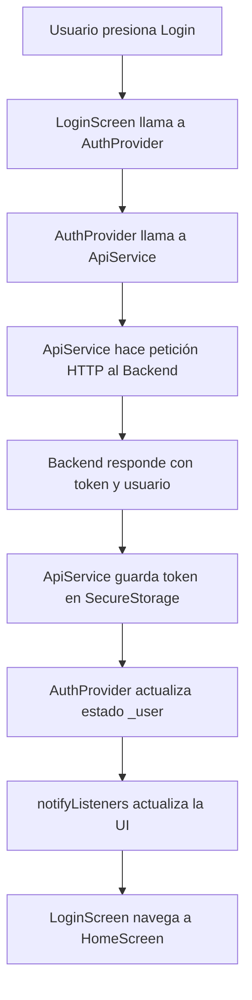

# 📱 Guía Completa de Flutter para RosTectic

Esta guía te explicará cómo funciona Flutter y cómo está organizado el proyecto RosTectic.

## 🎯 ¿Qué es Flutter?

**Flutter** es un framework de Google para crear aplicaciones **multiplataforma** (Android, iOS, Web, Desktop) con un **solo código base**. Usa el lenguaje **Dart**.

### Ventajas de Flutter
- ✅ **Una sola base de código** para móvil, web y desktop
- ✅ **Hot Reload**: Ves los cambios instantáneamente sin reiniciar la app
- ✅ **Rendimiento nativo**: Compila a código nativo (no usa WebView)
- ✅ **Widgets personalizables**: Todo es un widget (botones, textos, layouts, etc.)
- ✅ **Gran comunidad** y muchas librerías

---

## 🏗️ Conceptos Fundamentales de Flutter

### 1. **Todo es un Widget**

En Flutter, **TODO** es un widget: un botón, un texto, un layout, incluso la app completa.

```dart
// Ejemplo simple
Text('Hola Mundo')  // Widget de texto
ElevatedButton()    // Widget de botón
Container()         // Widget contenedor
```

### 2. **Tipos de Widgets**

#### **StatelessWidget** (Sin Estado)
Widgets que **NO cambian** después de crearse. Son inmutables.

```dart
class MiWidget extends StatelessWidget {
  @override
  Widget build(BuildContext context) {
    return Text('Soy inmutable');
  }
}
```

**Ejemplo**: Un texto que siempre dice lo mismo, un icono, una imagen estática.

#### **StatefulWidget** (Con Estado)
Widgets que **SÍ cambian** durante su vida. Pueden actualizarse.

```dart
class MiContador extends StatefulWidget {
  @override
  State<MiContador> createState() => _MiContadorState();
}

class _MiContadorState extends State<MiContador> {
  int contador = 0;  // Estado que puede cambiar
  
  @override
  Widget build(BuildContext context) {
    return Text('Contador: $contador');
  }
}
```

**Ejemplo**: Un formulario, un contador, una lista que se actualiza.

### 3. **El método build()**

Es el método **MÁS IMPORTANTE**. Define **qué se muestra en pantalla**.

```dart
@override
Widget build(BuildContext context) {
  return Scaffold(  // Estructura básica de una pantalla
    appBar: AppBar(title: Text('Mi App')),
    body: Center(child: Text('Contenido')),
  );
}
```

### 4. **Context**

Es como un "mapa" que te dice **dónde estás** en el árbol de widgets. Te permite:
- Acceder al tema de la app
- Navegar entre pantallas
- Acceder a providers (estado global)

```dart
// Obtener el tema
Theme.of(context).colorScheme.primary

// Navegar a otra pantalla
Navigator.pushNamed(context, '/home');

// Acceder a un provider
context.read<AuthProvider>()
```

---

## 📂 Estructura del Proyecto RosTectic

```
rostectic-app/
├── lib/
│   ├── main.dart              # 🚀 Punto de entrada
│   ├── config/                # ⚙️ Configuraciones
│   ├── models/                # 📦 Modelos de datos
│   ├── providers/             # 🔄 Gestión de estado
│   ├── services/              # 🌐 Servicios (API, etc)
│   ├── screens/               # 📱 Pantallas
│   └── widgets/               # 🧩 Widgets reutilizables
├── assets/                    # 🖼️ Imágenes, iconos
└── pubspec.yaml              # 📋 Dependencias
```

---

## 🔍 Explicación Detallada de Cada Archivo

### 1️⃣ **main.dart** - Punto de Entrada

```dart
void main() {
  runApp(const RosTecticApp());  // Inicia la aplicación
}
```

**¿Qué hace?**
- Es el **primer archivo** que se ejecuta
- `runApp()` toma un widget y lo muestra en pantalla
- Configura los **Providers** (estado global)
- Define el **tema** y las **rutas**

**Analogía**: Es como el `index.html` en web o `main()` en otros lenguajes.

---

### 2️⃣ **config/theme.dart** - Tema Visual

**¿Qué hace?**
Define los **colores, fuentes y estilos** de toda la app.

```dart
class AppTheme {
  static const Color primaryColor = Color(0xFFE91E63);  // Rosa
  
  static ThemeData lightTheme = ThemeData(
    colorScheme: ColorScheme.light(primary: primaryColor),
    textTheme: GoogleFonts.poppinsTextTheme(),
    // ... más configuraciones
  );
}
```

**Ventaja**: Cambias un color aquí y se actualiza en **toda la app**.

**Componentes principales**:
- `colorScheme`: Colores principales (primary, secondary, etc.)
- `textTheme`: Estilos de texto (títulos, cuerpo, etc.)
- `elevatedButtonTheme`: Estilo de botones
- `inputDecorationTheme`: Estilo de campos de texto

---

### 3️⃣ **config/routes.dart** - Navegación

**¿Qué hace?**
Define las **rutas** (URLs) de las pantallas.

```dart
class AppRoutes {
  static const String login = '/login';
  static const String home = '/home';
  
  static Map<String, WidgetBuilder> routes = {
    login: (context) => const LoginScreen(),
    home: (context) => const HomeScreen(),
  };
}
```

**Navegación**:
```dart
// Ir a otra pantalla
Navigator.pushNamed(context, AppRoutes.home);

// Volver atrás
Navigator.pop(context);

// Reemplazar pantalla actual
Navigator.pushReplacementNamed(context, AppRoutes.login);
```

**Analogía**: Como las rutas en React Router o Vue Router.

---

### 4️⃣ **config/api_config.dart** - Configuración API

**¿Qué hace?**
Centraliza todas las **URLs del backend**.

```dart
class ApiConfig {
  static const String baseUrl = 'http://localhost:3000/api';
  static const String login = '/auth/login/email';
  static const String services = '/services';
}
```

**Ventaja**: Si cambias la URL del servidor, solo lo haces en un lugar.

---

### 5️⃣ **models/user_model.dart** - Modelo de Datos

**¿Qué hace?**
Define la **estructura** de un usuario.

```dart
class User {
  final String id;
  final String name;
  final String? email;  // ? = puede ser null
  
  User({required this.id, required this.name, this.email});
  
  // Convertir JSON a User
  factory User.fromJson(Map<String, dynamic> json) {
    return User(
      id: json['id'],
      name: json['name'],
      email: json['email'],
    );
  }
  
  // Convertir User a JSON
  Map<String, dynamic> toJson() {
    return {'id': id, 'name': name, 'email': email};
  }
}
```

**¿Por qué es útil?**
- **Tipo seguro**: El editor te ayuda con autocompletado
- **Fácil conversión**: JSON ↔ Objeto
- **Validación**: Sabes qué datos esperar

---

### 6️⃣ **services/api_service.dart** - Cliente HTTP

**¿Qué hace?**
Maneja todas las **peticiones HTTP** al backend.

```dart
class ApiService {
  // Singleton (una sola instancia en toda la app)
  static final ApiService _instance = ApiService._internal();
  factory ApiService() => _instance;
  
  // GET request
  Future<http.Response> get(String endpoint) async {
    final url = Uri.parse('$baseUrl$endpoint');
    return await http.get(url, headers: _getHeaders());
  }
  
  // POST request
  Future<http.Response> post(String endpoint, Map<String, dynamic> body) async {
    final url = Uri.parse('$baseUrl$endpoint');
    return await http.post(url, headers: _getHeaders(), body: jsonEncode(body));
  }
}
```

**Conceptos clave**:
- **Singleton**: Solo existe una instancia de `ApiService` en toda la app
- **async/await**: Para operaciones asíncronas (como peticiones HTTP)
- **Future**: Representa un valor que estará disponible en el futuro

**Uso**:
```dart
final response = await ApiService().get('/services');
```

---

### 7️⃣ **providers/auth_provider.dart** - Gestión de Estado

**¿Qué hace?**
Maneja el **estado de autenticación** (login, registro, usuario actual).

```dart
class AuthProvider with ChangeNotifier {
  User? _user;  // Usuario actual (null si no está logueado)
  bool _isLoading = false;
  
  // Getters
  User? get user => _user;
  bool get isAuthenticated => _user != null;
  
  // Login
  Future<bool> loginWithEmail({required String email, required String password}) async {
    _isLoading = true;
    notifyListeners();  // Notifica a los widgets que escuchan
    
    // Llamar a la API
    // ...
    
    _isLoading = false;
    notifyListeners();  // Actualiza la UI
    return true;
  }
}
```

**Conceptos clave**:
- **ChangeNotifier**: Permite notificar cambios a los widgets
- **notifyListeners()**: Actualiza todos los widgets que escuchan este provider
- **Estado global**: Accesible desde cualquier pantalla

**Uso en widgets**:
```dart
// Leer el estado (no se actualiza automáticamente)
final user = context.read<AuthProvider>().user;

// Escuchar cambios (se actualiza automáticamente)
Consumer<AuthProvider>(
  builder: (context, auth, child) {
    return Text(auth.user?.name ?? 'Invitado');
  },
)
```

---

### 8️⃣ **screens/splash_screen.dart** - Pantalla de Inicio

**¿Qué hace?**
Muestra un **logo** durante 2 segundos y luego navega al login.

```dart
class SplashScreen extends StatefulWidget {
  @override
  State<SplashScreen> createState() => _SplashScreenState();
}

class _SplashScreenState extends State<SplashScreen> {
  @override
  void initState() {
    super.initState();
    _navigateToLogin();  // Se ejecuta al crear el widget
  }
  
  Future<void> _navigateToLogin() async {
    await Future.delayed(const Duration(seconds: 2));  // Espera 2 segundos
    Navigator.pushReplacementNamed(context, AppRoutes.login);
  }
  
  @override
  Widget build(BuildContext context) {
    return Scaffold(
      body: Container(
        decoration: BoxDecoration(
          gradient: LinearGradient(/* ... */),  // Gradiente de fondo
        ),
        child: Center(
          child: Column(
            children: [
              Icon(Icons.spa, size: 100),
              Text('RosTectic'),
              CircularProgressIndicator(),  // Indicador de carga
            ],
          ),
        ),
      ),
    );
  }
}
```

**Conceptos clave**:
- **initState()**: Se ejecuta una vez al crear el widget
- **Future.delayed()**: Espera un tiempo antes de continuar
- **Scaffold**: Estructura básica de una pantalla (appBar, body, etc.)
- **Container**: Widget contenedor con decoración
- **Column**: Organiza widgets verticalmente

---

### 9️⃣ **screens/auth/login_screen.dart** - Pantalla de Login

**¿Qué hace?**
Permite al usuario **iniciar sesión** con email o teléfono.

```dart
class LoginScreen extends StatefulWidget {
  @override
  State<LoginScreen> createState() => _LoginScreenState();
}

class _LoginScreenState extends State<LoginScreen> {
  final _formKey = GlobalKey<FormState>();  // Clave para el formulario
  final _emailController = TextEditingController();  // Controlador del input
  bool _isEmailLogin = true;  // Estado local
  
  Future<void> _handleLogin() async {
    if (!_formKey.currentState!.validate()) return;  // Validar formulario
    
    final authProvider = context.read<AuthProvider>();
    bool success = await authProvider.loginWithEmail(
      email: _emailController.text.trim(),
      password: _passwordController.text,
    );
    
    if (success) {
      Navigator.pushReplacementNamed(context, AppRoutes.home);
    }
  }
  
  @override
  Widget build(BuildContext context) {
    return Scaffold(
      body: Form(
        key: _formKey,
        child: Column(
          children: [
            TextFormField(
              controller: _emailController,
              validator: (value) {
                if (value == null || value.isEmpty) {
                  return 'Este campo es requerido';
                }
                return null;
              },
            ),
            ElevatedButton(
              onPressed: _handleLogin,
              child: Text('Iniciar Sesión'),
            ),
          ],
        ),
      ),
    );
  }
}
```

**Conceptos clave**:
- **TextEditingController**: Controla el valor de un campo de texto
- **Form + GlobalKey**: Para validar formularios
- **validator**: Función que valida cada campo
- **setState()**: Actualiza el estado local del widget

---

## 🔄 Flujo de Datos en RosTectic



---

## 🎨 Widgets Comunes en Flutter

### Layouts
- **Column**: Organiza widgets verticalmente
- **Row**: Organiza widgets horizontalmente
- **Container**: Contenedor con padding, margin, decoración
- **Center**: Centra su hijo
- **Padding**: Añade espacio alrededor
- **SizedBox**: Espacio fijo o contenedor con tamaño

### Inputs
- **TextFormField**: Campo de texto con validación
- **ElevatedButton**: Botón elevado
- **IconButton**: Botón con icono
- **Checkbox**: Casilla de verificación
- **Switch**: Interruptor

### Visualización
- **Text**: Texto
- **Icon**: Icono
- **Image**: Imagen
- **Card**: Tarjeta con sombra
- **CircularProgressIndicator**: Indicador de carga circular

---

## 🚀 Comandos Útiles de Flutter

```bash
# Ver dispositivos disponibles
flutter devices

# Ejecutar en web
flutter run -d chrome

# Ejecutar en Android
flutter run -d android

# Hot Reload (mientras corre)
# Presiona 'r' en la terminal

# Hot Restart (reinicio completo)
# Presiona 'R' en la terminal

# Limpiar proyecto
flutter clean

# Instalar dependencias
flutter pub get

# Ver logs
flutter logs
```

---

## 💡 Consejos para Aprender Flutter

1. **Piensa en widgets**: Todo es un widget que se combina con otros
2. **Usa Hot Reload**: Cambia código y ve resultados al instante
3. **Lee los errores**: Flutter da errores muy descriptivos
4. **Usa el inspector**: En VS Code, activa el Flutter Inspector
5. **Consulta la documentación**: [flutter.dev](https://flutter.dev)

---

## 📚 Recursos Adicionales

- **Documentación oficial**: https://flutter.dev/docs
- **Widget catalog**: https://flutter.dev/docs/development/ui/widgets
- **Codelabs**: https://flutter.dev/docs/codelabs
- **Pub.dev**: https://pub.dev (paquetes de Flutter)

---

## ❓ Preguntas Frecuentes

### ¿Por qué usar Provider?
Para compartir estado entre múltiples pantallas sin pasar datos manualmente.

### ¿Qué es async/await?
Permite escribir código asíncrono de forma más legible (como las Promises en JavaScript).

### ¿Cuándo usar StatelessWidget vs StatefulWidget?
- **Stateless**: Si el widget no cambia (texto estático, iconos)
- **Stateful**: Si el widget cambia (formularios, listas dinámicas)

### ¿Cómo debuggear?
- Usa `print('mensaje')` para logs
- Usa el Flutter DevTools
- Pon breakpoints en VS Code

---

¿Tienes alguna pregunta sobre algún concepto específico? 🤔
